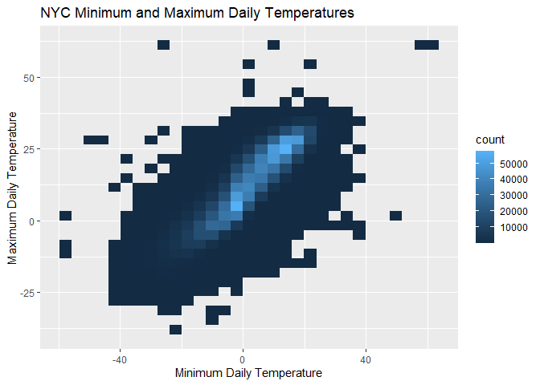
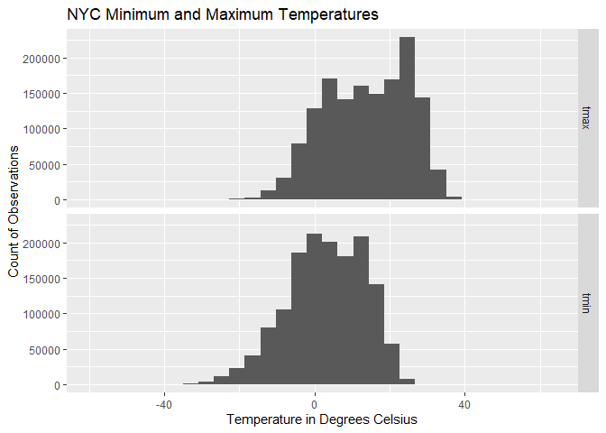
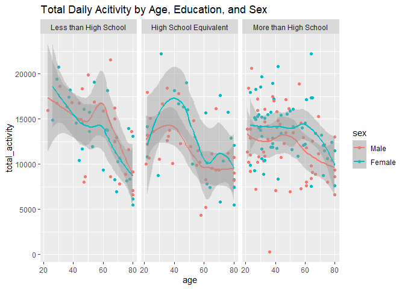
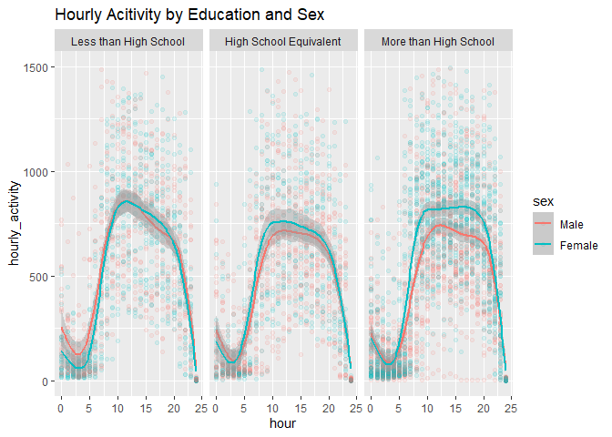

Weather Analysis
================
Wayne Monical
2024-10-10

This analysis uses data from the National Oceanic and Atmospheric
Administration (NOAA) on the temperature and precipitation in NYC. The
`ny_noaa` data set has 7 columns and 2595176 rows. Each observation
comes with an ID given by the `id` variable. Each observation has a
date, along with several precipitation and temperature measurements.

We begin with data cleaning by creating separate numeric variables for
year, month, and day.

``` r
ny_noaa=
  ny_noaa |> 
  mutate(
    year = ny_noaa |> pull(date) |> year(),
    month= ny_noaa |> pull(date) |> month(),
    day= ny_noaa |> pull(date) |> day()
  )
```

Using these new variables, we find that we have observations from 1981
to 2010.

Looking at the data’s description at
<https://p8105.com/dataset_noaa.html>, we can find that the
precipitation is given in tenths of millimeters, snowfall and snow depth
are given in millimeters, and maximum and minimum temperature are given
in tenths of degrees Celsius. Therefore we can adjust the columns to
make each column in whole millimeters or whole degrees Celsius.

``` r
ny_noaa = 
  ny_noaa |> 
  mutate(
    prcp = ny_noaa$prcp / 10,
    tmin = as.numeric(ny_noaa$tmin) / 10,
    tmax = as.numeric(ny_noaa$tmax) / 10)
```

There is also a single observation with negative snowfall, with ID
USC00307400 on June 15th, 2005.

``` r
ny_noaa |> filter(snow < 0)
```

    ## # A tibble: 1 × 10
    ##   id          date        prcp  snow  snwd  tmax  tmin  year month   day
    ##   <chr>       <date>     <dbl> <int> <int> <dbl> <dbl> <dbl> <dbl> <int>
    ## 1 USC00307400 2005-06-15   6.6   -13     0  31.7  16.1  2005     6    15

Given that New York typically does not receive snowfall in June, this
value is likely meant to be zero. However, the temperature values are
both within two standard deviations of the average temperature for June,
so I do not believe that this observation need be thrown out.

``` r
ny_noaa |> 
  filter(month == 6) |> 
  drop_na(tmin, tmax) |> 
  summarise(
    mean_june_tmin = mean(tmin),
    sd_june_tmin = sd(tmin),
    mean_june_tmax = mean(tmax),
    sd_june_tmax = sd(tmax))
```

    ## # A tibble: 1 × 4
    ##   mean_june_tmin sd_june_tmin mean_june_tmax sd_june_tmax
    ##            <dbl>        <dbl>          <dbl>        <dbl>
    ## 1           12.6         4.57           24.6         4.61

``` r
ny_noaa =
  ny_noaa |> 
  mutate(snow = ifelse(id == 'USC00307400', 0, snow))
```

However, even after correcting the units to millimeters, the daily
precipitation, snowfall, and snow depth have overly large maximum
values. The maximum snowfall for New York City was recorded as 693
millimeters on January 23, 2016 according to [this
website](https://www.currentresults.com/Yearly-Weather/USA/NY/New-York-City/extreme-annual-new-york-city-snowfall.php).
I do not see a clear cause of this issue. Errors in data collection,
such as the negative snowfall variable, could be at fault. To formally
deal with these values, I would inquire to the data collector for more
information. If I could not do that, I would simply discard any values
over NYC’s recorded maximum.

``` r
ny_noaa |> 
  select(prcp, snow, snwd) |> 
  summary()
```

    ##       prcp              snow             snwd       
    ##  Min.   :   0.00   Min.   :    0    Min.   :   0.0  
    ##  1st Qu.:   0.00   1st Qu.:    0    1st Qu.:   0.0  
    ##  Median :   0.00   Median :    0    Median :   0.0  
    ##  Mean   :   2.98   Mean   :    5    Mean   :  37.3  
    ##  3rd Qu.:   2.30   3rd Qu.:    0    3rd Qu.:   0.0  
    ##  Max.   :2286.00   Max.   :10160    Max.   :9195.0  
    ##  NA's   :145838    NA's   :381107   NA's   :591786

The most common values for snowfall are zero, 25, 13, and 51. I suspect
that this is because they are converting from inches and rounding to the
nearest millimeter. This is because there are 25.4 millimeters in an
inch. So half of one inch corresponds to 13 millimeters, one inch
corresponds to 25 millimeters, and two inches corresponds to 51
millimeters, which we see are the most common values.

``` r
ny_noaa |> 
  count(snow) |> 
  arrange(desc(n)) |> 
  head(5)
```

    ## # A tibble: 5 × 2
    ##    snow       n
    ##   <dbl>   <int>
    ## 1     0 2009394
    ## 2    NA  381107
    ## 3    25   30937
    ## 4    13   23004
    ## 5    51   18217

Below I have made two graphs comparing the daily maximum temperature to
the minimum temperature. The first graph is a two dimensional histogram.
We can see that there may be a positive relationship between minimum and
maximum temperature.

``` r
ny_noaa |> 
  drop_na(tmin, tmax) |> 
  ggplot(aes(x = tmin, y = tmax)) +
  geom_bin_2d()+ 
  labs(title = 'NYC Minimum and Maximum Daily Temperatures')+
  xlab('Minimum Daily Temperature') +
  ylab('Maximum Daily Temperature')
```

<!-- -->

The next graph is a histogram faceted based on temperature statistic:
minimum or maximum. It allows us to compare the two populations, but we
have lost the information on which readings are on the same day. It is
worth noting that these distributions are not close to normal.

``` r
ny_noaa |> 
  drop_na(tmin, tmax) |> 
  pivot_longer(
    cols = c('tmin', 'tmax'),
    names_to = 'temp_stat',
    values_to = 'temp_value') |> 
  ggplot(aes(x = temp_value)) +
  facet_grid(temp_stat~.)+
  geom_histogram()+ 
  labs(title = 'NYC Minimum and Maximum Temperatures')+
  xlab('Temperature in Degrees Celsius') +
  ylab('Count of Observations')
```

    ## `stat_bin()` using `bins = 30`. Pick better value with `binwidth`.

<!-- -->

Next we create a plot showing the distribution of snowfall values
greater than 0 millimeters and less than 100 millimeters in yeas of 2001
to 2004. As we previously observed, the measurements are biased towards
increments of one-quarter inches. Therefore, I have specified the
histogram’s bins to match.

``` r
ny_noaa |> 
  filter(
    snow > 0,
    snow < 100,
    year %in% c(2001, 2002, 2003, 2004)
    ) |> 
  ggplot(aes(x = snow)) + 
  geom_histogram(binwidth = 25) + 
  facet_grid(rows = year~.)+ 
  labs(title = 'NYC Snowfall by Year')+
  xlab('Snowfall in Millimeters') +
  ylab('Count of Observations')
```

<!-- -->

## Activity Data

### Loading and Cleaning Data

The next analysis uses the NHANES data on an obvserved cohort’s daily
activity. We begin by loading the data. The acceleration data comes in a
wide format. We pivot the data to be longer in order to tidy it. We also
transform the minute data to be numeric. We import the covariates data
set and find that it is already tidy.

``` r
accel = 
  read_csv('data/nhanes_accel.csv') |> 
  janitor::clean_names() |> 
  pivot_longer(
    cols = min1:min1440,
    names_to = 'minute',
    names_prefix = 'min',
    values_to = 'acceleration'
  ) |> 
  mutate(minute = as.numeric(minute))
```

    ## Rows: 250 Columns: 1441
    ## ── Column specification ────────────────────────────────────────────────────────
    ## Delimiter: ","
    ## dbl (1441): SEQN, min1, min2, min3, min4, min5, min6, min7, min8, min9, min1...
    ## 
    ## ℹ Use `spec()` to retrieve the full column specification for this data.
    ## ℹ Specify the column types or set `show_col_types = FALSE` to quiet this message.

``` r
covar = 
  read_csv('data/nhanes_covar.csv', skip = 4) |> 
  janitor::clean_names()
```

    ## Rows: 250 Columns: 5
    ## ── Column specification ────────────────────────────────────────────────────────
    ## Delimiter: ","
    ## dbl (5): SEQN, sex, age, BMI, education
    ## 
    ## ℹ Use `spec()` to retrieve the full column specification for this data.
    ## ℹ Specify the column types or set `show_col_types = FALSE` to quiet this message.

We check for missing data, and find the ID for each individual, `seqn`,
agrees.

``` r
anti_join(covar, accel)
```

    ## Joining with `by = join_by(seqn)`

    ## # A tibble: 0 × 5
    ## # ℹ 5 variables: seqn <dbl>, sex <dbl>, age <dbl>, bmi <dbl>, education <dbl>

Finally, we join together the data, and filter for participants of at
least 21 years of age, full demographic data, and encode the qualitative
variables as factors of character strings.

``` r
nhanes = 
  inner_join(covar, accel) |> 
  filter(age >= 21) |> 
  drop_na(sex, age, bmi, education) |> 
  mutate(
    sex = 
      factor(
        case_when(
          sex == 1 ~ 'Male', 
          sex == 2 ~ 'Female',
          !(sex %in% c(1,2)) ~ NA 
        ),
        levels = c('Male', 'Female')
      ),
    education = 
      factor(
       case_when(
         education == 1 ~ "Less than High School",
         education == 2 ~ "High School Equivalent",
         education == 3 ~ "More than High School",
         !(education %in% c(1,2, 3)) ~ NA 
       ),
       levels = c(
         'Less than High School', 
         'High School Equivalent',
         "More than High School"
         )
        )
  )
```

    ## Joining with `by = join_by(seqn)`

### Making Tables

Next, we make a reader-friendly table comparing sex to educational
attainment. We accomplish this by selecting for the relevant rows,
dropping duplicate rows, grouping our data by sex and education,
counting the observations, then formatting the table to be readable.
From the table, we can see that there are approximately the same number
of men and women in the study that have less than a high school
education and more than a high school education. There are more men than
women with a high school education.

``` r
nhanes |> 
  select(seqn, sex, education) |> 
  distinct() |> 
  group_by(sex, education) |> 
  summarize(count = n()) |>
  pivot_wider(
    names_from = sex, 
    values_from = count
    ) |> 
  knitr::kable()
```

    ## `summarise()` has grouped output by 'sex'. You can override using the `.groups`
    ## argument.

| education              | Male | Female |
|:-----------------------|-----:|-------:|
| Less than High School  |   27 |     28 |
| High School Equivalent |   35 |     23 |
| More than High School  |   56 |     59 |

Aggregating our data across all minutes in the day, we can plot the
total activity separated by age, sex, and education. While we cannot
draw any definitive conclusions without statistical tests, it appears
that activity has a general downward relationship with age across sex
and education. Among the high school educated and further, female study
participants had an overall higher level of activity than their male
counterparts.

``` r
nhanes |> 
  group_by(
    seqn, sex, age, education
  ) |> 
  summarize(total_activity = sum(acceleration)) |> 
  ggplot(aes(x = age, y = total_activity, color = sex)) +
  facet_grid(.~education) +
  geom_point() +
  geom_smooth()+ 
  labs(title = 'Total Daily Acitivity by Age, Education, and Sex')
```

    ## `summarise()` has grouped output by 'seqn', 'sex', 'age'. You can override
    ## using the `.groups` argument.
    ## `geom_smooth()` using method = 'loess' and formula = 'y ~ x'

<!-- -->

Aggregating instead by hour of the day, we see very similar activity
levels across sex and education. Activity increases from the fifth hour
to the tenth, where it gradually decreases until the twentieth hour,
where it drops off steeply. This pattern is affirmed by humans’
typically sleep cycle. Note that the graph below does not show all data
points, as it has been rescaled for clarity.

``` r
nhanes |> 
  mutate(
    hour = floor(minute / 60)
  ) |> 
  group_by(
    seqn, sex, age, education, hour
  ) |> 
  summarize(hourly_activity = sum(acceleration)) |> 
  ggplot(aes(x = hour, y = hourly_activity, color = sex)) +
  facet_grid(.~education) +
  geom_point(alpha = 0.1) +
  geom_smooth()+ 
  scale_y_continuous(limits = c(0, 1500))+ 
  labs(title = 'Hourly Acitivity by Education and Sex')
```

    ## `summarise()` has grouped output by 'seqn', 'sex', 'age', 'education'. You can
    ## override using the `.groups` argument.
    ## `geom_smooth()` using method = 'gam' and formula = 'y ~ s(x, bs = "cs")'

    ## Warning: Removed 43 rows containing non-finite outside the scale range
    ## (`stat_smooth()`).

    ## Warning: Removed 43 rows containing missing values or values outside the scale range
    ## (`geom_point()`).

<!-- -->

## Citibike Data

Following the theme of activity, we next analyze NYC Citibike ride data.
To load the Citibike data, we import the four data frames from each of
the four months. We add additional variables specifying the year and
month of data collection, then combine them all. We also rename the
`customer_type` variable for clarity, and we set the month names and
weekdays as ordered factors so that they appear in the order as expected
during tabling and graphing.

``` r
citi = list(
    mutate(
      read_csv('data/Jan 2020 Citi.csv',
               show_col_types = FALSE),
      month = 'January', year = 2020),
    mutate(
      read_csv('data/July 2020 Citi.csv',
               show_col_types = FALSE),
      month = 'July', year = 2020),
    mutate(
      read_csv('data/Jan 2024 Citi.csv',
               show_col_types = FALSE),
      month = 'January', year = 2024),
    mutate(
      read_csv('data/July 2024 Citi.csv',
               show_col_types = FALSE),
      month = 'July', year = 2024)
) |> bind_rows() |> 
  mutate(
    customer_type = member_casual,
    month = factor(month, levels = c('January', 'July')),
    weekdays = factor(weekdays, levels = 
                        c('Monday', 'Tuesday', 'Wednesday', 
                          'Thursday', 'Friday', 'Saturday',
                          'Sunday')),
    year = factor(year)
  )
```

Here we produce a reader-friendly table showing the total number of
rides in each combination of year, month, and membership. From the
table, we can see that there is far more member ridership than
non-member ridership, especially in the month of January 2020. We can
also see that there is more ridership in July than in January. This
difference is explainable by rider preference for fair weather.

``` r
citi |> 
  group_by(year, month, customer_type) |> 
  summarise(ride_count = n()) |> 
  pivot_wider(
    names_from = customer_type,
    values_from = ride_count
  ) |> 
  knitr::kable(
    col.names = c('Year', 'Month', 'Non-member Ride Count', 'Member Ride Count'))
```

    ## `summarise()` has grouped output by 'year', 'month'. You can override using the
    ## `.groups` argument.

| Year | Month   | Non-member Ride Count | Member Ride Count |
|:-----|:--------|----------------------:|------------------:|
| 2020 | January |                   984 |             11436 |
| 2020 | July    |                  5637 |             15411 |
| 2024 | January |                  2108 |             16753 |
| 2024 | July    |                 10894 |             36262 |

Next we investigate the most popular starting stations in July of 2024.

``` r
citi |> 
  filter(year == 2024, month == 'July') |> 
  group_by(start_station_name) |> 
  summarise(ride_count = n()) |> 
  arrange(desc(ride_count)) |> 
  head(5) |> 
  knitr::kable(col.names = c('Starting Station', 'Ride Count'))
```

| Starting Station         | Ride Count |
|:-------------------------|-----------:|
| Pier 61 at Chelsea Piers |        163 |
| University Pl & E 14 St  |        155 |
| W 21 St & 6 Ave          |        152 |
| West St & Chambers St    |        150 |
| W 31 St & 7 Ave          |        146 |

Next we investigate the effect of day of the week, month, and year on
median ride duration. Firstly, we can see that median ride duration is
shorter in 2024 than it is in 2020. This could be due to rider choice
changing, or the availability of additional docking stations, allowing
riders to take shorter rides. We can also see that ride duration is
typically longer during the month of July, likely due to rider
preference for fair weather. Across all months and years, we see a
slight uptick in the duration of rides as the week goes on, with the
largest median rides occurring on Saturday and Sunday.

``` r
citi |> 
  group_by(weekdays, month, year) |> 
  summarise(Median_Duration = median(duration)) |> 
  ggplot(aes(x = month, fill = weekdays, y = Median_Duration))+
  facet_grid(year ~ . ) +
  geom_bar(position = 'dodge', stat = 'identity')+ 
  labs(title = 'Median Citibike Ride Duration')
```

    ## `summarise()` has grouped output by 'weekdays', 'month'. You can override using
    ## the `.groups` argument.

<!-- -->

Next we investigate the effect of month, customer type, and bike type
ride duration in 2024. Since very few rides are longer than 75 minutes,
we filter for rides under 75 minutes long. We then create a four panel
graph, faceting by customer type and month. We have used color to show
the difference between each bike type. We have normalized each
histogram. From the graph, we can see that electric bikes are used less
than their human-powered counterparts across month and customer type.
This could be due to the the persistent unavailability of electric bikes
or consumer choice against electric bikes due to safety, cost, and
docking concerns.

``` r
citi |> 
  filter(year == 2024, duration < 75) |> 
  ggplot(aes(x = duration, fill = rideable_type))+
  facet_grid(customer_type ~ month) +
  geom_histogram(aes(y = ..density..)) + 
  labs(title = '2024 Electric and Classic Bike Usage')
```

    ## Warning: The dot-dot notation (`..density..`) was deprecated in ggplot2 3.4.0.
    ## ℹ Please use `after_stat(density)` instead.
    ## This warning is displayed once every 8 hours.
    ## Call `lifecycle::last_lifecycle_warnings()` to see where this warning was
    ## generated.

    ## `stat_bin()` using `bins = 30`. Pick better value with `binwidth`.

<!-- -->
